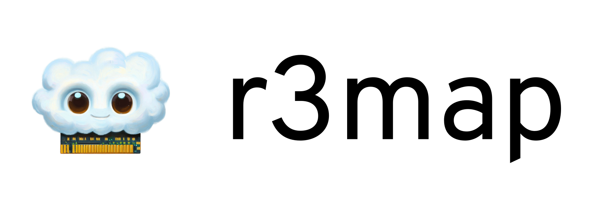

# r3map



Re**m**ote **mm**ap: High-performance remote memory region mounts and migrations in user space.

[](https://github.com/pojntfx/r3map/actions/workflows/hydrun.yaml)

[](https://pkg.go.dev/github.com/pojntfx/r3map)
[](https://matrix.to/#/#r3map:matrix.org?via=matrix.org)

## Overview

r3map enables high-performance remote memory region mounts and migrations in user space.

It enables you to ...

- **Mount and migrate memory regions with a unified API**: r3map provides a consistent API, no matter if a memory region should simply be accessed or migrated between hosts.
- **Expose a resource with multiple frontends**: By providing multiple interfaces (such as a memory region and a file/path) for accessing or migrating a resource, integrating remote memory into existing applications is possible with little to no changes.
- **Transparently map almost any resource into memory, only fetching chunks as they are being read**: By exposing a simple backend interface and being fully transport-independent, r3map makes it possible to map resources such as a S3 bucket, Cassandra or Redis database, or even a tape drive into a memory region efficiently, as well as migrating a region over a framework and protocol of your choice, such as gRPC.
- **Use remote memory without the associated overhead**: Despite being in user space, r3map manages (on a [typical desktop system](https://pojntfx.github.io/networked-linux-memsync/main.html#testing-environment)) to achieve **high throughput (up to 3 GB/s)** with **minimal access latencies (~100µs)** and **short initialization times (~15ms)**.
- **Adapt to challenging network environments**: By implementing various optimizations such as background pull and push, two-phase protocols for migrations and concurrent device initialization, r3map can be deployed both in low-latency, high-throughput local datacenter networks and more constrained networks like the public internet.

The project is accompanied by a scientific thesis, which provides additional insights into design decisions, the internals of its implementation and comparisons to existing technologies and alternative approaches:

[](https://pojntfx.github.io/networked-linux-memsync/main.pdf)

## Installation

You can add r3map to your Go project by running the following:

```shell
$ go get github.com/pojntfx/r3map/...@latest
```

## Usage

🚧 This project is a work-in-progress! Instructions will be added as soon as it is usable. 🚧

## Reference

### Mounts and Migrations

There are two fundamental use cases for r3map: Mounts and migrations. Mounting refers to accessing a resource, where the resource (such as a S3 bucket, remote file or memory region, tape drive etc.) is made available locally as either read-only or read-write, without having to download the entire resource first. Mounts work similarly to `mmap`, except the can map almost any resource into memory, not just files. To learn more about mounts, see the [Push-Pull Synchronization with Mounts](https://pojntfx.github.io/networked-linux-memsync/main.html#push-pull-synchronization-with-mounts) chapter in the accompanying thesis.

Migration refers to moving a resource like a memory region and moving it from one host to another. While mounts are optimized to have low initialization latencies and the best possible throughput performance, migrations are optimized to have the smallest possible downtime, where downtime refers to the typically short period in the migration process where neither the source nor the destination host can write to the resource that is being migrated. To optimize for this, migrations have a two-phase protocol which splits the device initialization and critical migration phases into two distinct parts, which keeps downtime to a minimum. To learn more about mounts, see the [Pull-Based Synchronization with Migrations](https://pojntfx.github.io/networked-linux-memsync/main.html#pull-based-synchronization-with-migrations) chapter in the accompanying thesis.

### Path, Slice and File Frontends

In order to make adoption of r3map for new and existing applications as frictionless as possible, multiple frontends with different layers of abstraction are provided, for both mounts and migrations. These frontends make it possible to access the resource with varying degrees of transparency, with individual chunks only being fetched as they are needed or being fetched pre-emptively, depending on the API chosen.

The path frontend is the simplest one; it simply exposes a resource as a block device and returns the path, which can then be read/written to/from by the application consuming the resource. The slice frontend adds a layer of indirection which exposes the resource as a `[]byte` by `mmap`ing the block device and integrating it with the resources' lifecycle, making it possible to access the resource in a more transparent way. Similarly so, the file frontend exposes the block device as a file integrated with the resource lifecycle, making it easier to use r3map for applications that already use a file interface.

> ⚠️ Note that the Go garbage collector is currently known to [cause deadlocks in some cases with the slice frontend](https://pojntfx.github.io/networked-linux-memsync/main.html#limitations) if the application using it runs in the same process. To work around this, prefer using the file frontend, or make sure that the client application is started in a separate process if the slice frontend is being used.

### Direct Mounts, Managed Mounts and Pull Priority

Direct mounts serve as the simplest mount API, and allow directly mapping a resource into memory. These mounts can be either read-only or read-write, and simply forwards reads/writes between a backend (such as a S3 bucket) and the memory region/frontend. Direct mounts work well in LAN deployments, but since chunks are only fetched from the backend as they are being accessed, and writes are immediately forwarded to the backend too, this can lead to performance issues in high-latency deployments like the public internet, since reads need to be synchronous.

In contrast to this, the managed mount API allows for smart background pull and push mechanisms. This makes it possible to pre-emptively fetch chunks before they are being accessed, and writing back changes periodically. Since this can be done concurrently and asynchronously, managed mounts are much less vulnerable to networks with high RTT like the internet, where they [can significantly increase throughput and decrease access latency](https://pojntfx.github.io/networked-linux-memsync/main.html#access-methods), allowing for deployment in WAN.

Managed mounts also allow for the use of a [pull priority function](https://pojntfx.github.io/networked-linux-memsync/main.html#background-pull-and-push); this allows an application to specify which chunks should be pulled first and in which order, which can be used to further increase throughput and decrease latency by having the most important chunks be available as quickly as possible. This is particularly useful if the resource has a known structure: For example, if the metadata is available at the end of a media file but needs to be available first to start playback, the pull priority function can [help optimize the pull process without having to change the format or re-encoding](https://pojntfx.github.io/networked-linux-memsync/main.html#universal-database-media-and-asset-streaming).

### Backends

Backends represent a way of accessing a resource (in the case of mounts) and locally storing a resource (in the case of migrations). They are defined as by a simple interface, as [introduced by go-nbd](https://github.com/pojntfx/go-nbd#1-define-a-backend):

```go
type Backend interface {
	ReadAt(p []byte, off int64) (n int, err error)
	WriteAt(p []byte, off int64) (n int, err error)
	Size() (int64, error)
	Sync() error
}
```

Since the interface is so simple, it is possible to represent almost any resource with it. There are also a few example backends available:

- [Memory](https://github.com/pojntfx/go-nbd/blob/main/pkg/backend/memory.go): Exposes a memory region as a resource
- [File](https://github.com/pojntfx/go-nbd/blob/main/pkg/backend/file.go): Exposes a file as a resource
- [Directory](./pkg/backend/directory.go): Exposes a directory of chunks as a resource
- [Redis](./pkg/backend/redis.go): Exposes a Redis database as a resource
- [Cassandra](./pkg/backend/cassandra.go): Exposes a Cassandra/ScyllaDB database as a resource
- [S3](./pkg/backend/s3.go): Exposes a S3 bucket as a resource
- [RPC](pkg/backend/rpc.go): Exposes any backend over an RPC framework of choice, such as gRPC

Different backends tend to have different characteristics, and behave [differently depending on network conditions and access patterns](https://pojntfx.github.io/networked-linux-memsync/main.html#backends). Depending on the backend used, it might also require a chunking system, which [can be implemented on both the client and server side](https://pojntfx.github.io/networked-linux-memsync/main.html#chunking-3); see the [mount benchmarks](./cmd/r3map-benchmark-managed-mount/main.go) for more information.

## Examples

To make getting started with r3map easier, take a look at the following simple usage examples:

- [Direct and Managed Mount Example Server (gRPC-based)](./cmd/r3map-example-mount-server/main.go)
- [Direct Mount Example Client (gRPC-based)](./cmd/r3map-example-direct-mount/main.go)
- [Managed Mount Example Client (gRPC-based)](./cmd/r3map-example-managed-mount/main.go)
- [Migration Example (gRPC-based)](./cmd/r3map-example-migration/main.go)

The benchmarks also serve as much more detailed examples, highlighting different configuration options, transports and backends:

- [Direct and Managed Mount Benchmark Server](./cmd/r3map-benchmark-mount-server/main.go)
- [Direct Mount Benchmark](./cmd/r3map-benchmark-direct-mount/main.go)
- [Managed Mount Benchmark](./cmd/r3map-benchmark-managed-mount/main.go)
- [Migration Benchmark Server](./cmd/r3map-benchmark-migration-server/main.go)
- [Migration Benchmark](./cmd/r3map-benchmark-migration/main.go)

## Related Projects

- [tapisk](https://github.com/pojntfx/tapisk) exposes a tape drive as a block device using r3map's managed mounts and chunking system.
- [ram-dl](https://github.com/pojntfx/ram-dl) uses r3map to share RAM/swap space between two hosts with direct mounts.

## Acknowledgements

- [pojntfx/go-bd](https://github.com/pojntfx/go-nbd) provides the Go NBD client and server.
- [pojntfx/dudirekta](https://github.com/pojntfx/dudirekta) provides one of the example RPC frameworks for mounts and migrations.
- [gRPC](https://grpc.io/) provides a reliable RPC framework for mounts and migrations.
- [fRPC](https://frpc.io/) provides a high-performance RPC framework for mounts and migrations.

## Contributing

To contribute, please use the [GitHub flow](https://guides.github.com/introduction/flow/) and follow our [Code of Conduct](./CODE_OF_CONDUCT.md).

To build and start a development version of one of the examples locally, run the following:

```shell
$ git clone https://github.com/pojntfx/r3map.git
$ cd go-nbd

# TODO: Add contribution commands from scratchpad
```

Have any questions or need help? Chat with us [on Matrix](https://matrix.to/#/#r3map:matrix.org?via=matrix.org)!

## License

r3map (c) 2023 Felicitas Pojtinger and contributors

SPDX-License-Identifier: Apache-2.0
